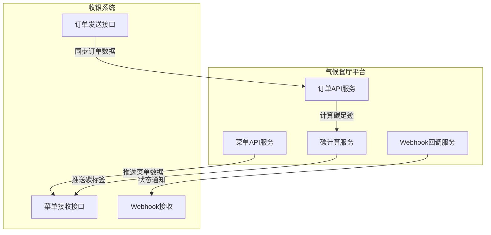

# 收银系统接口设计方案

## 一、架构设计原则

### 1.1 核心设计理念

- **标准化**: 采用RESTful API标准，易于对接各种收银系统
- **兼容性**: 支持主流收银系统（客如云、二维火、美团收银等）的接口规范
- **双向数据流**: 
- **菜单数据**: 气候餐厅平台 → 收银系统（推送模式）
- **订单数据**: 收银系统 → 气候餐厅平台 → 收银系统（同步模式）
- **可扩展性**: 预留扩展接口，支持未来新增数据类型

### 1.2 技术选型

- **主要协议**: RESTful API (HTTPS)
- **辅助机制**: Webhook回调（用于实时通知）
- **数据格式**: JSON
- **认证方式**: API Key + 签名验证（兼容OAuth 2.0）

## 二、接口架构设计

### 2.1 接口分类




### 2.2 数据流设计

#### 流程1: 菜单配置推送（气候餐厅 → 收银系统）

1. 餐厅在气候餐厅平台配置菜单、完成碳足迹计算
2. 气候餐厅平台通过API推送菜单数据到收银系统
3. 收银系统接收并更新本地菜单
4. 收银系统返回确认结果（包含同步状态）

#### 流程2: 订单数据同步（收银系统 → 气候餐厅 → 收银系统）

1. 收银系统产生订单后，通过API推送订单数据到气候餐厅平台
2. 气候餐厅平台计算订单碳足迹、生成碳标签
3. 气候餐厅平台将计算结果推回收银系统
4. 收银系统更新订单信息（包含碳标签）

## 三、接口规范设计

### 3.1 基础配置

**基础URL**: `https://api.climate-restaurant.com/v1/pos`**通用请求头**:

```javascript
Content-Type: application/json
Authorization: Bearer {access_token}
X-API-Key: {api_key}
X-Signature: {signature}
X-Timestamp: {timestamp}
X-Nonce: {nonce}
```


### 3.2 认证机制

采用**API Key + HMAC签名**的双重认证：

```javascript
// 签名算法
const signature = HMAC-SHA256(
  method + url + timestamp + nonce + body,
  secret_key
)
```


### 3.3 菜单推送接口

**接口路径**: `POST /pos/menu/sync`**请求示例**:

```json
{
  "restaurantId": "rest_123456",
  "syncType": "full|incremental",
  "menuItems": [
    {
      "itemId": "menu_001",
      "itemName": "素麻婆豆腐",
      "category": "主菜",
      "price": 38.00,
      "unit": "份",
      "status": "active|inactive",
      "ingredients": [
        {
          "ingredientName": "豆腐",
          "quantity": 200,
          "unit": "g"
        }
      ],
      "cookingMethod": "stir_fried",
      "carbonFootprint": {
        "value": 0.45,
        "unit": "kg CO₂e",
        "calculationLevel": "L2",
        "baseline": 1.2,
        "reduction": 0.75,
        "carbonLevel": "low",
        "certification": "气候友好"
      },
      "carbonLabel": {
        "level": "low|medium|high",
        "icon": "https://cdn.example.com/label-low.png",
        "description": "低碳排放菜品"
      },
      "updatedAt": "2025-01-15T10:30:00Z"
    }
  ],
  "timestamp": "2025-01-15T10:30:00Z"
}
```

**响应示例**:

```json
{
  "code": 0,
  "message": "同步成功",
  "data": {
    "syncId": "sync_20250115103000",
    "totalCount": 50,
    "successCount": 48,
    "failedCount": 2,
    "failedItems": [
      {
        "itemId": "menu_049",
        "reason": "数据格式错误"
      }
    ],
    "syncAt": "2025-01-15T10:30:05Z"
  }
}
```


### 3.4 订单同步接口

**接口路径**: `POST /pos/order/sync`**请求示例（收银系统 → 气候餐厅）**:

```json
{
  "orderId": "POS_ORDER_202501151030001",
  "restaurantId": "rest_123456",
  "orderTime": "2025-01-15T10:30:00Z",
  "items": [
    {
      "menuItemId": "menu_001",
      "itemName": "素麻婆豆腐",
      "quantity": 2,
      "unitPrice": 38.00,
      "totalPrice": 76.00
    }
  ],
  "totalAmount": 76.00,
  "customerInfo": {
    "customerId": "customer_001",
    "phone": "138****1234"
  }
}
```

**响应示例（气候餐厅 → 收银系统）**:

```json
{
  "code": 0,
  "message": "订单处理成功",
  "data": {
    "orderId": "POS_ORDER_202501151030001",
    "carbonImpact": {
      "totalCarbonFootprint": 0.90,
      "unit": "kg CO₂e",
      "baseline": 2.40,
      "carbonReduction": 1.50,
      "reductionPercent": 62.5,
      "carbonLevel": "low"
    },
    "items": [
      {
        "menuItemId": "menu_001",
        "carbonFootprint": 0.90,
        "carbonLabel": {
          "level": "low",
          "icon": "https://cdn.example.com/label-low.png"
        }
      }
    ],
    "processedAt": "2025-01-15T10:30:03Z"
  }
}
```


### 3.5 批量订单同步接口

**接口路径**: `POST /pos/orders/batch-sync`支持批量上传订单，适用于定时批量同步场景。

### 3.6 Webhook回调接口

**接口路径**: 由收银系统提供**回调事件类型**:

- `menu.sync.completed`: 菜单同步完成
- `order.carbon.calculated`: 订单碳足迹计算完成
- `carbon.label.updated`: 碳标签更新通知

**回调请求示例**:

```json
{
  "event": "order.carbon.calculated",
  "timestamp": "2025-01-15T10:30:03Z",
  "data": {
    "orderId": "POS_ORDER_202501151030001",
    "carbonFootprint": 0.90,
    "status": "success"
  },
  "signature": "hmac_signature"
}
```


## 四、实现方案

### 4.1 新增云函数

**`cloudfunctions/pos-interface/`**

- `index.js`: 主入口，处理菜单推送和订单接收
- `menu-sync.js`: 菜单同步逻辑
- `order-sync.js`: 订单同步逻辑
- `auth.js`: 认证和签名验证
- `webhook.js`: Webhook回调处理

### 4.2 数据库设计

**集合**: `pos_integrations`

- 存储收银系统接入配置（API密钥、回调地址等）

**集合**: `pos_sync_logs`

- 记录同步日志，便于排查问题

### 4.3 接口适配层

设计**适配器模式**，支持不同收银系统的接口差异：

```javascript
// 接口适配器示例
class POSAdapter {
  // 适配器接口
  async pushMenu(menuData) {}
  async syncOrder(orderData) {}
}

// 客如云适配器
class KRYAdapter extends POSAdapter {
  async pushMenu(menuData) {
    // 转换为客如云格式
  }
}

// 二维火适配器
class E2FAdapter extends POSAdapter {
  async pushMenu(menuData) {
    // 转换为二维火格式
  }
}
```


## 五、安全与容错

### 5.1 安全措施

- **HTTPS传输**: 所有接口使用HTTPS
- **签名验证**: 防止数据篡改
- **频率限制**: API调用频率限制（如100次/分钟）
- **IP白名单**: 可选，限制允许调用的IP地址

### 5.2 容错机制

- **重试机制**: 同步失败时自动重试（指数退避）
- **数据校验**: 严格的数据格式验证
- **降级策略**: 接口失败时的降级处理
- **日志记录**: 完整的操作日志，便于问题排查

## 六、实施步骤

1. **阶段1**: 实现基础接口框架（认证、基础API）
2. **阶段2**: 实现菜单推送功能
3. **阶段3**: 实现订单同步功能
4. **阶段4**: 实现适配器层（支持多种收银系统）
5. **阶段5**: 完善监控、日志和容错机制

## 七、文档管理

### 7.1 文档存储位置

所有接口模块开发过程中的文档类文件，统一保存至：**`Docs/项目策划方案/平台数据接口/`**

### 7.2 文档类型

- API接口规范文档
- 集成指南文档
- 接口测试文档
- 适配器开发文档
- 错误处理文档
- 其他相关技术文档

## 八、参考标准