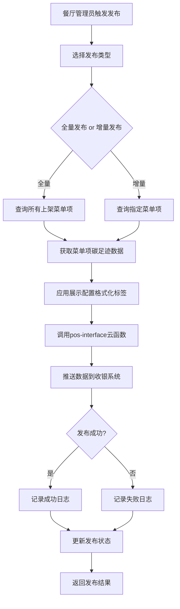

# 菜单环保信息展示配置系统架构说明

## 1. 配置存储位置

### 1.1 数据库集合

配置数据保存在 MongoDB 集合 `restaurant_menu_display_configs` 中。

### 1.2 数据模型结构

每个配置文档包含以下字段：

- `restaurantId`: 餐厅ID（必填，用于区分不同餐厅）
- `tenantId`: 租户ID（从餐厅信息中获取）
- `globalConfig`: 全局配置（默认展示级别、启用状态等）
- `mediaConfig`: 媒介配置（针对6种媒介类型的个性化配置）
- `physicalMenu`: 纸质菜单
- `digitalMenu`: 电子菜单
- `mobileApp`: 移动端App/小程序
- `onlineMenu`: 在线菜单
- `posSystem`: 收银系统
- `receipt`: 小票打印
- `styleConfig`: 视觉样式配置（图标大小、颜色方案、位置等）
- `features`: 功能开关（过滤、排序、推荐等）
- `textConfig`: 文本自定义（多语言支持：zh_CN, en_US）
- `version`: 版本号（用于乐观锁和版本控制）
- `status`: 状态（'active'/'inactive'，支持配置历史记录）
- `createdAt`, `updatedAt`: 时间戳
- `createdBy`, `updatedBy`: 操作人

### 1.3 存储位置代码引用

- 配置创建：[cloudfunctions/menu-carbon-label/index.js:910-913](cloudfunctions/menu-carbon-label/index.js)
- 配置查询：[cloudfunctions/menu-carbon-label/index.js:437-451](cloudfunctions/menu-carbon-label/index.js)
- 配置更新：[cloudfunctions/menu-carbon-label/index.js:959-1020](cloudfunctions/menu-carbon-label/index.js)

## 2. 与餐厅菜单系统的集成方式

### 2.1 集成流程

```javascript
菜单项请求 → 获取配置 → 应用配置 → 格式化标签 → 返回结果
```


### 2.2 核心集成点

#### 2.2.1 配置获取

在获取菜单项的碳标签时，系统会根据 `restaurantId` 和 `media` 类型自动获取对应的配置：

```javascript
// 代码位置：cloudfunctions/menu-carbon-label/index.js:99-100
const config = await getRestaurantConfig(restaurantId, media);
```


#### 2.2.2 配置应用

配置会应用于以下场景：

1. **标签格式化**：根据配置的展示级别和显示内容选项，决定标签显示的详细信息
2. **样式应用**：根据配置的图标大小、颜色方案等，生成对应的标签样式
3. **多语言支持**：根据配置的文本自定义，返回对应语言的标签文本

#### 2.2.3 配置缓存机制

- 使用内存缓存（1小时TTL）提高性能
- 缓存键格式：`${restaurantId}_${media}`
- 配置更新时自动清除缓存

### 2.3 集成代码位置

- 菜单项标签获取：[cloudfunctions/menu-carbon-label/index.js:66-134](cloudfunctions/menu-carbon-label/index.js)
- 批量标签获取：[cloudfunctions/menu-carbon-label/index.js:149-295](cloudfunctions/menu-carbon-label/index.js)
- 配置获取与合并：[cloudfunctions/menu-carbon-label/index.js:511-564](cloudfunctions/menu-carbon-label/index.js)
- 标签格式化：[cloudfunctions/menu-carbon-label/index.js:569-618](cloudfunctions/menu-carbon-label/index.js)

## 3. API接口集成方案

### 3.1 云函数接口

所有接口通过 `menu-carbon-label` 云函数提供，使用 action 模式区分不同操作。

#### 3.1.1 配置管理接口

**获取配置**

```javascript
// 调用方式
{
  action: 'getMenuDisplayConfig',
  data: {
    restaurantId: 'restaurant_id',
    version: 1  // 可选
  }
}

// 返回示例
{
  code: 0,
  message: '成功',
  data: {
    restaurantId: 'restaurant_id',
    globalConfig: {...},
    mediaConfig: {...},
    styleConfig: {...},
    features: {...},
    textConfig: {...},
    version: 1,
    status: 'active',
    updatedAt: '2024-01-01T00:00:00.000Z'
  }
}
```

**创建配置**

```javascript
{
  action: 'createMenuDisplayConfig',
  data: {
    restaurantId: 'restaurant_id',
    config: {
      globalConfig: {...},
      mediaConfig: {...},
      styleConfig: {...},
      features: {...},
      textConfig: {...}
    }
  }
}
```

**更新配置**

```javascript
{
  action: 'updateMenuDisplayConfig',
  data: {
    restaurantId: 'restaurant_id',
    config: {...},
    version: 1  // 必填，用于乐观锁
  }
}
```


#### 3.1.2 标签获取接口

**获取单个菜单项标签**

```javascript
{
  action: 'getMenuItemCarbonLabel',
  data: {
    restaurantId: 'restaurant_id',
    menuItemId: 'menu_item_id',
    media: 'physicalMenu',  // 可选，默认'basic'
    language: 'zh_CN'       // 可选，默认'zh_CN'
  }
}
```

**批量获取菜单项标签**

```javascript
{
  action: 'getMenuItemsCarbonLabels',
  data: {
    restaurantId: 'restaurant_id',
    menuItemIds: ['id1', 'id2'],  // 可选
    media: 'digitalMenu',
    language: 'zh_CN',
    filter: {
      carbonLevel: 'low',
      category: 'main'
    },
    sort: {
      field: 'carbonFootprint',
      order: 'asc'
    },
    page: 1,
    pageSize: 20
  }
}
```

**获取订单标签**

```javascript
{
  action: 'getOrderCarbonLabel',
  data: {
    orderId: 'order_id',
    media: 'receipt',
    language: 'zh_CN'
  }
}
```


### 3.2 前端服务封装

前端通过服务层封装了所有API调用：

- 服务文件：[admin-web/src/services/menuDisplayConfig.ts](admin-web/src/services/menuDisplayConfig.ts)
- 配置管理页面：[admin-web/src/pages/restaurant/MenuDisplayConfig.tsx](admin-web/src/pages/restaurant/MenuDisplayConfig.tsx)

### 3.3 与其他系统集成的建议

#### 3.3.1 通过HTTP触发器（推荐）

如果需要通过HTTP方式调用，可以：

1. 为云函数创建HTTP访问服务
2. 使用标准的RESTful接口设计
3. 添加API密钥或OAuth认证

#### 3.3.2 通过小程序云开发

在小程序端直接调用：

```javascript
wx.cloud.callFunction({
  name: 'menu-carbon-label',
  data: {
    action: 'getMenuItemCarbonLabel',
    data: {
      restaurantId: 'xxx',
      menuItemId: 'xxx'
    }
  }
})
```


#### 3.3.3 通过SDK集成

可以在其他后端系统中：

1. 使用腾讯云SDK调用云函数
2. 或直接连接MongoDB读取配置数据（需要权限控制）

### 3.4 API接口代码位置

- 接口路由分发：[cloudfunctions/menu-carbon-label/index.js:22-55](cloudfunctions/menu-carbon-label/index.js)
- 配置管理接口：[cloudfunctions/menu-carbon-label/index.js:425-1044](cloudfunctions/menu-carbon-label/index.js)

## 4. 菜单发布到收银系统功能

### 4.1 功能概述

菜单发布功能允许餐厅管理员将菜单数据和环保标识信息发布到收银系统（POS系统）或其他餐厅管理软件。菜单信息和环保标识是**打包在一起同时发布**的，确保收银系统能够完整展示菜单的环保信息。

### 4.2 数据发布流程




### 4.3 后端接口实现

#### 4.3.1 菜单发布接口

**云函数**: `pos-interface`**Action**: `pushMenu`**接口位置**: [cloudfunctions/pos-interface/index.js:60-61](cloudfunctions/pos-interface/index.js)**实现模块**: [cloudfunctions/pos-interface/menu-sync.js:26-160](cloudfunctions/pos-interface/menu-sync.js)**请求参数**:

```javascript
{
  action: 'pushMenu',
  data: {
    restaurantId: 'restaurant_id',  // 必填，餐厅ID
    syncType: 'full',                // 必填，'full'全量或'incremental'增量
    menuItemIds: ['id1', 'id2']      // 可选，增量发布时指定菜单项ID列表
  }
}
```

**响应格式**:

```javascript
{
  code: 0,
  message: '同步成功',
  data: {
    syncId: 'sync_20250115103000_abc123',
    totalCount: 50,
    successCount: 48,
    failedCount: 2,
    failedItems: [
      {
        itemId: 'menu_049',
        reason: '数据格式错误'
      }
    ],
    syncAt: '2025-01-15T10:30:00Z'
  }
}
```


#### 4.3.2 数据格式化

菜单数据在发布前会经过格式化处理，确保包含完整的环保标识信息：**格式化函数**: [cloudfunctions/pos-interface/menu-sync.js:167-187](cloudfunctions/pos-interface/menu-sync.js)**格式化后的菜单项数据结构**:

```javascript
{
  itemId: 'menu_001',
  itemName: '素麻婆豆腐',
  category: '主菜',
  price: 38.0,
  unit: '份',
  status: 'active',
  description: '经典川菜，麻辣鲜香',
  imageUrl: 'https://cdn.example.com/images/menu_001.jpg',
  ingredients: [...],
  cookingMethod: 'stir_fried',
  // 碳足迹数据
  carbonFootprint: {
    value: 0.45,
    unit: 'kg CO₂e',
    calculationLevel: 'L2',
    baseline: 1.2,
    reduction: 0.75,
    carbonLevel: 'low',
    certification: '气候友好',
    calculatedAt: '2025-01-15T10:00:00Z'
  },
  // 碳标签信息
  carbonLabel: {
    level: 'low',
    icon: 'https://cdn.example.com/labels/low-carbon.png',
    description: '低碳排放菜品',
    qrCode: 'https://cdn.example.com/qrcodes/menu_001.png'
  },
  updatedAt: '2025-01-15T10:30:00Z'
}
```


#### 4.3.3 发布日志记录

发布操作会记录到 `pos_sync_logs` 集合中，用于追踪发布历史和排查问题。**日志记录模块**: [cloudfunctions/pos-interface/logging.js](cloudfunctions/pos-interface/logging.js)**日志数据结构**:

```javascript
{
  restaurantId: 'restaurant_id',
  action: 'pushMenu',
  posSystem: 'system_name',
  syncType: 'full',
  status: 'success',  // 'success' | 'failed'
  requestData: {...},
  responseData: {...},
  error: null,  // 失败时记录错误信息
  duration: 1234,  // 执行耗时（毫秒）
  createdAt: '2025-01-15T10:30:00Z'
}
```


### 4.4 前端页面实现（方案B：独立发布管理页面）

#### 4.4.1 菜单发布管理页面

**页面路径**: `admin-web/src/pages/restaurant/MenuPublish.tsx`**功能模块**:

1. **发布配置区域**

- 选择发布类型（全量/增量）
- 选择要发布的菜单项（增量发布时）
- 选择目标收银系统（如果配置了多个）
- 预览发布数据

2. **发布操作区域**

- "发布到收银系统"按钮
- 发布进度显示
- 实时状态更新

3. **发布历史区域**

- 发布历史记录列表
- 筛选和搜索功能
- 查看发布详情
- 重试失败发布

**页面结构**:

```typescript
interface MenuPublishPage {
  // 发布配置
  syncType: 'full' | 'incremental'
  selectedMenuItems: string[]
  targetPosSystem: string
  
  // 发布状态
  publishing: boolean
  publishProgress: number
  
  // 发布历史
  syncHistory: SyncLog[]
}
```


#### 4.4.2 收银系统集成配置页面

**页面路径**: `admin-web/src/pages/restaurant/PosIntegration.tsx`**功能模块**:

1. **集成配置管理**

- 添加/编辑收银系统集成配置
- 配置API地址、密钥等信息
- 测试连接功能
- 启用/禁用集成

2. **集成状态显示**

- 显示当前集成状态
- 显示最后同步时间
- 显示同步统计信息

**配置数据结构**:

```typescript
interface PosIntegration {
  _id: string
  restaurantId: string
  posSystem: string  // 收银系统类型
  apiUrl: string     // API地址
  apiKey: string     // API密钥
  secretKey: string  // 签名密钥（加密存储）
  webhookUrl?: string // Webhook回调地址
  status: 'active' | 'inactive'
  lastSyncAt?: string
  syncStats: {
    totalSyncs: number
    successSyncs: number
    failedSyncs: number
  }
  createdAt: string
  updatedAt: string
}
```


#### 4.4.3 发布历史记录页面

**页面路径**: `admin-web/src/pages/restaurant/SyncHistory.tsx`**功能模块**:

1. **历史记录列表**

- 显示所有发布历史记录
- 支持按时间、状态、类型筛选
- 支持搜索功能

2. **记录详情**

- 查看发布详情
- 查看成功/失败的菜单项列表
- 查看错误信息
- 重试失败发布

**历史记录数据结构**:

```typescript
interface SyncLog {
  _id: string
  restaurantId: string
  action: 'pushMenu' | 'syncOrder'
  posSystem: string
  syncType: 'full' | 'incremental'
  status: 'success' | 'failed'
  totalCount: number
  successCount: number
  failedCount: number
  failedItems: Array<{
    itemId: string
    reason: string
  }>
  duration: number
  error?: string
  createdAt: string
}
```


### 4.5 前端服务层实现

#### 4.5.1 收银系统集成服务

**服务文件**: `admin-web/src/services/posIntegration.ts`**主要方法**:

```typescript
// 获取集成配置列表
getIntegrations(restaurantId: string): Promise<PosIntegration[]>

// 创建集成配置
createIntegration(data: CreateIntegrationData): Promise<PosIntegration>

// 更新集成配置
updateIntegration(id: string, data: UpdateIntegrationData): Promise<PosIntegration>

// 删除集成配置
deleteIntegration(id: string): Promise<void>

// 测试连接
testConnection(id: string): Promise<{ success: boolean; message: string }>

// 发布菜单
publishMenu(data: PublishMenuData): Promise<PublishMenuResult>

// 获取发布历史
getSyncHistory(params: SyncHistoryParams): Promise<SyncLog[]>

// 重试发布
retrySync(syncId: string): Promise<PublishMenuResult>
```


#### 4.5.2 发布菜单数据接口

**调用示例**:

```typescript
// 全量发布
await posIntegrationAPI.publishMenu({
  restaurantId: 'rest_123456',
  syncType: 'full'
})

// 增量发布
await posIntegrationAPI.publishMenu({
  restaurantId: 'rest_123456',
  syncType: 'incremental',
  menuItemIds: ['menu_001', 'menu_002']
})
```


### 4.6 数据库集合

#### 4.6.1 pos_integrations 集合

存储收银系统集成配置信息。**集合位置**: 由 `initPosInterfaceCollections` 初始化**索引**:

- `restaurantId` + `posSystem` (复合唯一索引)
- `restaurantId` (普通索引)
- `status` (普通索引)

#### 4.6.2 pos_sync_logs 集合

存储发布历史记录。**集合位置**: 由 `initPosInterfaceCollections` 初始化**索引**:

- `restaurantId` + `createdAt` (复合索引)
- `restaurantId` + `status` (复合索引)
- `syncId` (唯一索引)

### 4.7 路由配置

在 `admin-web/src/App.tsx` 或路由配置文件中添加以下路由：

```typescript
{
  path: '/restaurant/menu-publish',
  element: <MenuPublish />
},
{
  path: '/restaurant/pos-integration',
  element: <PosIntegration />
},
{
  path: '/restaurant/sync-history',
  element: <SyncHistory />
}
```


### 4.8 权限控制

发布功能需要以下权限：

- `restaurant:menu:publish` - 发布菜单权限
- `restaurant:integration:manage` - 管理集成配置权限
- `restaurant:sync:view` - 查看发布历史权限

### 4.9 用户体验优化

1. **发布进度显示**

- 实时显示发布进度百分比
- 显示当前处理的菜单项数量
- 显示预计剩余时间

2. **错误处理**

- 友好的错误提示信息
- 失败项详细说明
- 一键重试功能

3. **数据预览**

- 发布前预览将要发布的数据
- 显示数据统计信息
- 验证数据完整性

### 4.10 代码位置总结

**后端代码**:

- 云函数入口: [cloudfunctions/pos-interface/index.js](cloudfunctions/pos-interface/index.js)
- 菜单同步处理: [cloudfunctions/pos-interface/menu-sync.js](cloudfunctions/pos-interface/menu-sync.js)
- 日志记录: [cloudfunctions/pos-interface/logging.js](cloudfunctions/pos-interface/logging.js)
- 数据库初始化: [cloudfunctions/database/init-pos-interface-collections.js](cloudfunctions/database/init-pos-interface-collections.js)

**前端代码**（待实现）:

- 发布管理页面: `admin-web/src/pages/restaurant/MenuPublish.tsx`
- 集成配置页面: `admin-web/src/pages/restaurant/PosIntegration.tsx`