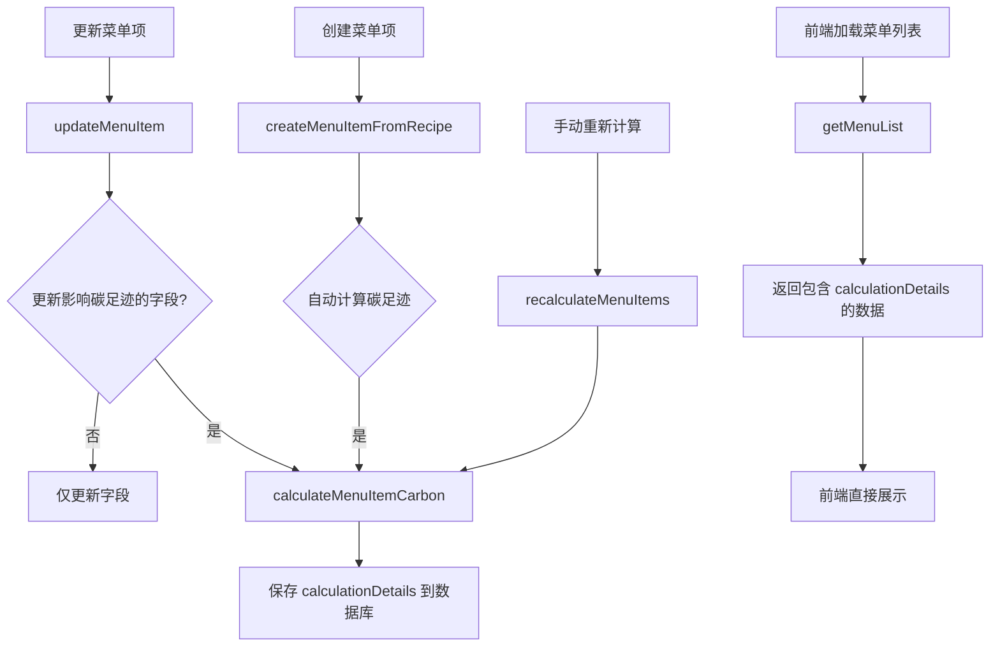

# 菜单碳足迹

计算明细优化方案

## 目标

1. 在菜单项数据中直接包含计算明细，避免前端单独请求
2. 明确计算触发时机并自动更新
3. 前端默认收起状态，按需展示明细

## 当前状态分析

### 计算流程

- **计算位置**：后端云函数 `restaurant-menu-carbon`
- **计算函数**：`calculateCarbonFootprint` 已生成 `calculationDetails`
- **保存位置**：目前 `recalculateMenuItems` 只保存了 `carbonFootprint`, `baselineInfo`, `factorMatchInfo`，**未保存 `calculationDetails`**

### 触发时机

- `recalculateMenuItems`：手动重新计算时
- `updateMenuItem`：**目前不会自动触发计算**
- `createMenuItemFromRecipe`：**目前不会自动计算**

## 实现方案

### 1. 后端：保存计算明细到数据库

#### 1.1 修改 `recalculateMenuItems` 

**文件**：`cloudfunctions/restaurant-menu-carbon/index.js`在更新菜单项时，添加 `calculationDetails` 字段：

```javascript
// 行 1818-1826，在 updateData 中添加
const updateData = {
  carbonFootprint: calculateResult.data.carbonFootprint,
  baselineInfo: calculateResult.data.baselineInfo,
  factorMatchInfo: calculateResult.data.factorMatchInfo || [],
  calculationDetails: calculateResult.data.calculationDetails || null, // 新增
  calculationLevel: preservedCalculationLevel,
  optimizationFlag: calculateResult.data.optimizationFlag,
  calculatedAt: calculateResult.data.calculatedAt,
  restaurantRegion: menuItem.restaurantRegion || calculationRegion || 'national_average'
};
```


#### 1.2 修改 `updateMenuItem` 自动触发计算

**文件**：`cloudfunctions/tenant/index.js`检测是否更新了影响碳足迹的字段，如果是则自动计算：

```javascript
// 行 5029-5044 之前添加检测逻辑
const carbonRelatedFields = ['ingredients', 'mealType', 'energyType', 'cookingMethod', 'cookingTime', 'restaurantRegion', 'calculationLevel'];
const shouldRecalculate = carbonRelatedFields.some(field => updateFields.hasOwnProperty(field) || 
  (field === 'ingredients' && updateFields.ingredients !== undefined));

if (shouldRecalculate) {
  // 调用重新计算API
  // 需要获取更新后的完整菜单项数据，然后调用 calculateMenuItemCarbon
  // 计算后保存 calculationDetails
}
```

具体实现：

- 先执行字段更新
- 获取更新后的菜单项
- 调用 `calculateMenuItemCarbon` 计算
- 更新 `carbonFootprint` 和 `calculationDetails`

#### 1.3 修改 `createMenuItemFromRecipe` 自动计算

**文件**：`cloudfunctions/tenant/index.js`在创建菜单项后，自动调用计算：

```javascript
// 行 4720 左右，创建菜单项成功后
// 调用 calculateMenuItemCarbon 计算碳足迹
const calculateResult = await cloud.callFunction({
  name: 'restaurant-menu-carbon',
  data: {
    action: 'calculateMenuItemCarbon',
    data: {
      restaurantId: restaurantId,
      mealType: menuItemData.mealType,
      energyType: menuItemData.energyType,
      calculationLevel: menuItemData.calculationLevel || 'L2',
      region: menuItemData.restaurantRegion,
      ingredients: menuItemData.ingredients,
      cookingMethod: menuItemData.cookingMethod,
      cookingTime: menuItemData.cookingTime,
    }
  }
});

// 如果计算成功，更新菜单项的 carbonFootprint 和 calculationDetails
if (calculateResult.result && calculateResult.result.code === 0) {
  await db.collection('restaurant_menu_items').doc(createResult._id).update({
    data: {
      carbonFootprint: calculateResult.result.data.carbonFootprint,
      baselineInfo: calculateResult.result.data.baselineInfo,
      factorMatchInfo: calculateResult.result.data.factorMatchInfo || [],
      calculationDetails: calculateResult.result.data.calculationDetails || null,
      calculationLevel: menuItemData.calculationLevel || 'L2',
      optimizationFlag: calculateResult.result.data.optimizationFlag,
      calculatedAt: calculateResult.result.data.calculatedAt,
    }
  });
}
```


### 2. 前端：优化展示逻辑

#### 2.1 修改默认展开状态

**文件**：`admin-web/src/pages/carbon/Menu.tsx`

```javascript
// 行 67-70，修改默认展开逻辑
// 从：默认展开所有卡片
// 改为：默认全部收起
const [expandedKeys, setExpandedKeys] = useState<string[]>([])

// 移除行 76-77 的自动展开逻辑
// 删除：const allIds = transformedItems.map(...); setExpandedKeys(allIds);
```


#### 2.2 从菜单项数据中读取计算明细

**文件**：`admin-web/src/pages/carbon/Menu.tsx`

```javascript
// 修改 renderCalculationDetails 函数
// 行 340 左右
const renderCalculationDetails = (menuItem: MenuItem) => {
  const menuItemId = menuItem.id || menuItem._id || ''
  
  // 直接从菜单项数据中读取 calculationDetails
  const details = (menuItem.carbonFootprint as any)?.calculationDetails || 
                  (menuItem as any).calculationDetails ||
                  calculationDetailsMap[menuItemId] // 保留缓存作为备用

  if (!details) {
    return (
      <div style={{ padding: '24px', textAlign: 'center', color: '#999' }}>
        <InfoCircleOutlined style={{ fontSize: '24px', marginBottom: '8px' }} />
        <div>暂无计算明细数据</div>
        <div style={{ marginTop: '8px', fontSize: '12px' }}>
          点击"重新计算"按钮获取详细的计算明细
        </div>
      </div>
    )
  }
  
  // 使用 details 渲染明细...
}
```


#### 2.3 移除不必要的API调用

**文件**：`admin-web/src/pages/carbon/Menu.tsx`

- 移除 `fetchCalculationDetails` 函数（如果不再需要）
- 移除 `loadingDetailsMap` 状态管理
- 简化 `handlePanelChange` 函数，只处理展开/收起

### 3. 类型定义更新

#### 3.1 更新 MenuItem 类型

**文件**：`admin-web/src/types/menuItem.ts`

```typescript
export interface MenuItem {
  // ... 现有字段
  calculationDetails?: CalculationDetails // 新增
}

// 新增 CalculationDetails 接口定义（如果不存在）
export interface CalculationDetails {
  ingredients: Array<{
    ingredientName: string
    category?: string
    quantity: number
    unit: string
    weightInKg: number
    wasteRate?: number
    factor?: {
      value: number
      unit: string
      matchLevel?: string
      source?: string
    } | null
    carbonFootprint: number
    calculation?: {
      formula: string
      values: {
        EF: number
        M: number
        W: number
        result: number
      }
    }
    warning?: string
  }>
  energy?: {
    method?: string
    time?: number
    energyType?: string
    carbonFootprint: number
  }
  packaging?: {
    carbonFootprint: number
  }
  transport?: {
    carbonFootprint: number
  }
  total: number
}
```


## 数据流图




## 影响碳足迹的字段清单

- `ingredients` - 食材列表
- `mealType` - 餐食类型
- `energyType` - 用能方式
- `cookingMethod` - 烹饪方式
- `cookingTime` - 烹饪时间
- `restaurantRegion` - 适用区域
- `calculationLevel` - 计算级别

## 注意事项